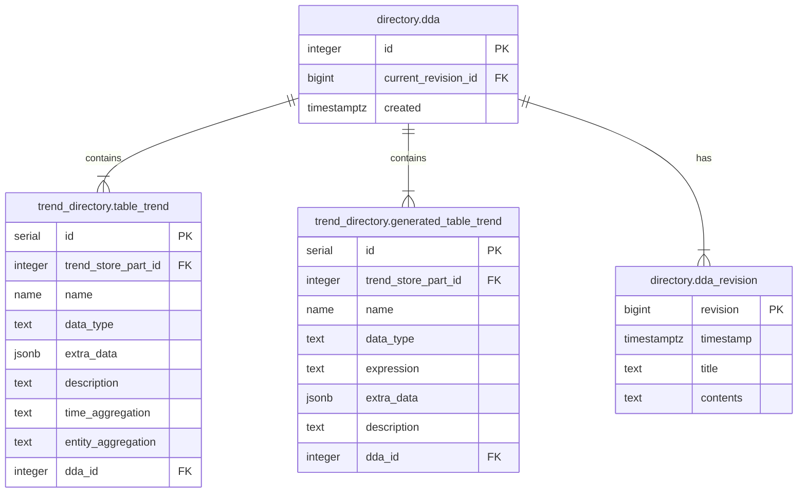

# DDAs

Data Delivery Agreements (DDAs) are documents that describe multiple aspects of
the exchange of data between a producer and a consumer. In Minerva this applies
to both ends of the system: the end where data is ingested and the end where
data is exported. For each piece of data that a consumer sees, there will be
a DDA that states:

- Who is the owner
- What is the retention
- What are technical aspects of the data like datatype, value range etc.

