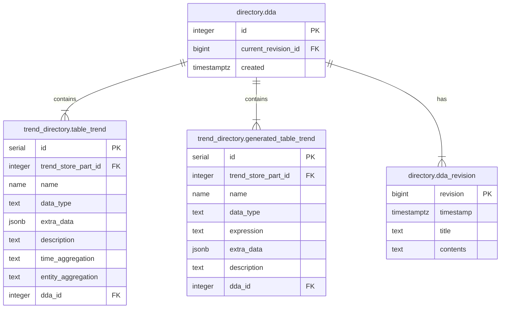

# DDAs

## Introduction

As for every data platform, it is a given that there is data incoming and data
outgoing. For both sides, you want to have agreements in place about aspects
such as when data is provided, what format it has and who to contact in case of
issues or planned changes.

We want to have these agreements stored next to the data and linked to the
data. this way, users and system operators have quick access to the details of
these agreements.

## Requirements

The following requirements need to be fulfilled.

1. Each trend and attribute has a corresponding dda
2. A DDA can change over time and the history needs to be kept

## Detailed Design

