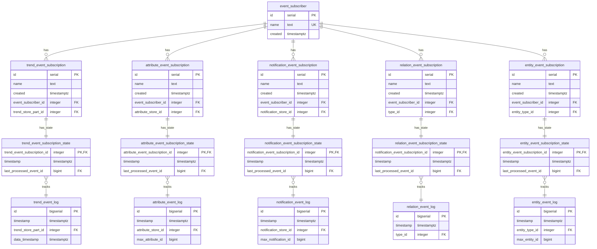

# Generic Event Based Updating

For a data platform as Minerva, it is essential that all data is as up-to-date
as possible using as little resources as possible. For trend materialization,
an event-based updating mechanism has been in use for a long time and this
works really well. We want to use a similar mechanism for all such updating
based on changes. A few concrete examples:

1. Updating of relation tables
2. Updating of alias tables
3. External data that is based on data in Minerva

## Approach

1. A generic stream of change events is stored in a table as an audit log with an
   autoincrement Id.
2. The state of Because the different types of data have different identifiable chunks of
   data to trigger changes on, we treat them differently.

### Streams Of Events Per Data Type

The change events are stored in a separate log table for each type of data.

### Entity Relationship Diagram

