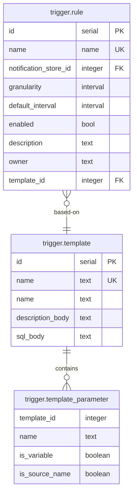

# Minerva Notification Triggers

Notification triggers are a mechanism that allows for generating notifications
based on any combination of data in Minerva and a rule that determines what
combination of values in the data should result in a notification.

The mechanism is very generic and powerful, but also requires knowledge of the
SQL, Minerva structures and the data itself.

## ERD 



## Description Format

The description of a trigger is stored in the description field as Markdown.

The Markdown flavor is a combination of CommonMark and GitHub Flavored Markdown
as supported by [Marked.js](https://marked.js.org/#specifications)

It is assumed that mermaid support is available when rendering the Markdown.

## Template Based Triggers

Template-based triggers are a form of notification triggers that are easy to
use for end-users because the form a predefined pattern that is created for
common use-cases and does not require the end-user to write any SQL.

* All 'v-cell' trends (vendor specific counters and pre-calculated KPIs) with
  granularity 1d within a Minerva ETL instance can be selected in a trigger
  template (other granularities will follow in later releases)
* Trigger attributes are stored in table: `trigger.rule`.
  New fields to be added:
  - owner (contact person for adjustments and keeping trigger-set up-to-date)
  - template_id (FK to `trigger.template.id` - null means it's a provisioned
    trigger that can not be adjusted by end users)
  - entity_set entity_id (`entity.entity_set`). A Minerva event trigger can be
    linked to at most 1 entity set (no specified entity set, entity_set
    entity_id = NULL means a nationwide trigger)
* Table storing available trigger templates named `trigger.template` with fields:
  - id
  - name
  - template
  - variable_mapping (mapping of template variables; representation)

### YAML Formatted Template

Trigger templates can be stored in a YAML based format:
```yaml
name: {user_defined_trigger_name}
kpi_data:
- name: "{selected_kpi}"
  data_type: numeric
kpi_function: |-
    BEGIN
        RETURN QUERY EXECUTE $query$
        select
            t.entity_id as entity_id,
            $1,
            t."{selected_kpi}" as "{selected_kpi}"
        from trend."tripaiku_v-cell_1d" t
        $query$ USING $1;
    END;
thresholds:
- name: "{trend_1}_[lt|le|gt|ge]"
  data_type: numeric
  value: {value_1}
condition: |-
    {trend_1} {[<|<=|>|>=]} {value_1}
weight: |-
    SELECT {value_1}
data: |-
    SELECT json_build_object(
        'cell', vce.cell,
        'site', vce.site,
        'lci', vce.lci,
        'place', vce.place,
        'address', vce.address,
        'postal_code', vce.postal_code,
        'longitude', vce.wgs84_longitude,
        'latitude', vce.wgs84_latitude,
        'cel_type', replace(vce."CEL_TYPE", 'SWAP_', ''),
        '{selected_kpi}', $1."{selected_kpi}",
        'cell_priority', vce."CELL_PRIORITY",
        'site_priority', vce."SITE_PRIORITY",
        'medium', vce.medium
    )
    FROM cached."inventory_v-cell_ext" vce
    WHERE vce.entity_id = $1.entity_id
tags: ['SSE']
notification_store: trigger-notification
trend_store_links:
- part_name: tripaiku_v-cell_1d
mapping_function: mapping_id
mapping_functions: []
granularity: 1 day
description: |-
    {trend_1} {[<|<=|>|>=]} **${value_1}**</br>

    #### weighing

    {user_defined_weighing_value}

    #### auto close

    {user_selected_auto_close_rule}
```

## Thresholds

### Threshold History

The history of threshold settings can be very usefull for explaining and
trouble-shooting previously created notifications because there is a record of
what the thresholds were at the time of the notification creation.

Each revision is a record with the threshold settings for a specific period.
The start of the period is the creation time and the end of the period is
filled in when a new revision of the thresholds is created with the start of
the new revision. The most recent revision always has an open end.

A table contains each revision of the thresholds with the respective start and
end of the validity period:

| Name               | Data Type               |
|--------------------|-------------------------|
| revision           | integer                 |
| valid_period       | tstzrange               |
| \<threshold_name\> | \<threshold_data_type\> |
| \<threshold_name\> | \<threshold_data_type\> |
| \<threshold_name\> | \<threshold_data_type\> |

The tables are named `<trigger_name>_history`.

An example of such a table for a specific trigger:

| revision | valid_period                             | max_power |
|---------:|------------------------------------------|----------:|
|        1 | ["2025-01-12 13:50", "2025-01-15 14:44") |      0.05 |
|        2 | ["2025-01-15 14:44", "2025-01-19 12:59") |     0.045 |
|        3 | ["2025-01-19 12:59", "2025-01-22 17:01") |     0.046 |
|        4 | ["2025-01-22 17:01",)                    |     0.047 |

The current threshold revision number is stored with the trigger rule:

| id | name                    | notification_store_id | granularity | default_interval | enabled | threshold_revision | description |
|---:|-------------------------|----------------------:|-------------|------------------|---------|-------------------:|-------------|
|  1 | node/15m/highpowerusage |                     1 | 00:15:00    |                  | t       |                  4 |             |

A view is used to deliver the current thresholds for use in trigger rules:

| max_power |
|----------:|
|     0.047 |

The view just selects the record matching the `threshold_revision` value with
the `revision` column in the threshold history table.

```
SELECT max_power
FROM trigger_rule."node/15m/highpowerusage_history" h
JOIN trigger.rule ON rule.threshold_revision = h.revision
WHERE rule.name = 'node/15m/highpowerusage';
```
