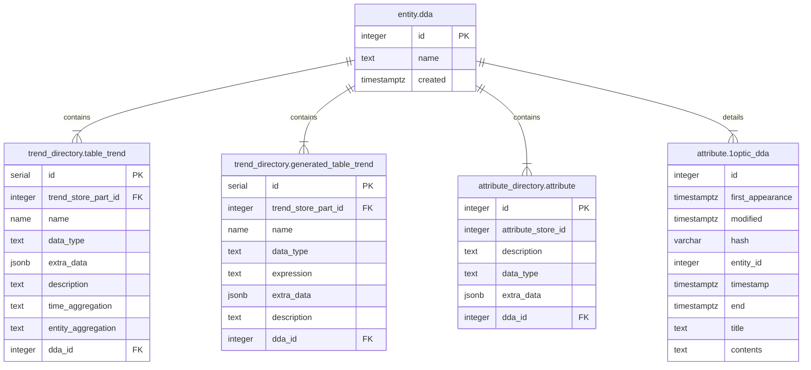

# DDAs

## Introduction

As for every data platform, it is a given that there is data incoming and data
outgoing. For both sides, you want to have agreements in place about aspects
such as when data is provided, what format it has and who to contact in case of
issues or planned changes.

We want to have these agreements stored next to the data and linked to the
data. this way, users and system operators have quick access to the details of
these agreements.

## Requirements

The following requirements need to be fulfilled.

1. Each trend and attribute has a corresponding DDA
2. A DDA can change over time and the history needs to be kept

## Design Choices

1. Using standard attribute storage for storing the DDAs because this supports
   keeping a history with multiple versions.
2. Using normal entities to identify DDAs and these are linked to the attribute
   data with DDA information.
3. Entity types and attribute stores are created during normal Minerva schema
   initialization.
4. Extra functionality will be added to the attribute storage for efficiently
   adding and updating a single DDA.
5. Contents of a DDA will be a plain Markdown text document
6. DDAs can be provisioned from a Minerva instance definition using YAML files
   and referenced Markdown files with the content.

## Detailed Design

### Schema

1. A data source `1optic` will be created for the DDA attribute store and other future 1Optic specific data.
2. An entity type `dda` will be created resuling in a table `entity.dda`.
3. An attribute store will be created with data source `1optic` and entity type `dda` that stores the DDA details.
4. A foreign key will be added from the `trend_directory.table_trend` table to the `entity.dda` id column to always have a DDA linked to a trend.
5. A foreign key will be added from the `trend_directory.generated_table_trend` table to the `entity.dda` id column to always have a DDA linked to a generated trend.
5. A foreign key will be added from the `attribute_directory.attribute` table to the `entity.dda` id column to always have a DDA linked to an attribute.

